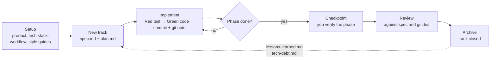

# Measure

**Measure twice, code once.**

Measure keeps AI coding agents on plan. Every change starts as a written spec, becomes a task in a phased plan, and ends as a tested commit that you can trace and revert.

Measure is a set of agent skills, agent roles, and a Claude Code mod. It stores your project context in a `measure/` folder inside your repository, so each new agent session starts with the same knowledge as the last one.

> Measure is a community fork of [Google's Conductor](https://github.com/gemini-cli-extensions/conductor), extended with project memory, multi-agent orchestration, and live guard rails in Claude Code.

---

## Why use Measure?

- **Context that survives sessions.** Your product definition, tech stack, workflow, and style guides live in `measure/`, next to your code. Agents read them before they plan or write anything.
- **Plans that agents follow.** Each unit of work is a *track* with a `spec.md` and a phased `plan.md`. Agents work task by task: a failing test first, then the code, then one commit with a git note.
- **Checkpoints with a human in the loop.** At the end of each phase, the agent stops, gives you a verification plan, and waits for your "yes".
- **Memory across tracks.** `lessons-learned.md` and `tech-debt.md` carry gotchas and shortcuts into the next track. Both stay under 50 lines, so they stay useful.
- **Rollback by meaning.** Revert a whole track, a phase, or one task, not a list of commit hashes.
- **Guard rails you can see.** In Claude Code, the measure-guard mod shows the plan position above the prompt and stops edits that no task covers.

---

## How it works



1. **Setup** defines the project once.
2. **New track** turns a request into a spec and a plan, with acceptance criteria and tasks.
3. **Implement** runs the plan. Each task is one Red–Green cycle and one commit.
4. **Review** checks the result against the spec, the style guides, and the lessons from earlier tracks.
5. **Archive** closes the track. The retrospective feeds the project memory for the next track.

---

## Quick start

### 1. Install the skills

```bash
git clone https://github.com/bodangren/measure.git
cd measure
./bin/install-measure-skill
```

The installer copies the skills and the agent roles from the `main` branch into `~/.claude/skills`, `~/.agents/skills`, and `~/.agents/agents`. It skips a location whose parent folder does not exist.

If you already have an older copy of Measure in those folders, run `./bin/install-measure-skill --check` first. Then run `./bin/install-measure-skill --adopt` once to replace the old files.

### 2. Keep it current (optional)

```bash
./bin/install-measure-skill --cron install
```

This adds one hourly cron job that installs from `main`. Your other cron jobs stay as they are. A checked-out feature branch never reaches your agents, because the installer always reads `main`, not the working tree.

### 3. Set up your project

In your project, ask your agent:

```
/measure setup
```

Measure interviews you about the product, the tech stack, and your workflow, then writes the `measure/` folder. It can also show 3 design directions from [getdesign.md](https://getdesign.md) as a tabbed HTML preview.

### 4. Run your first track

```
/measure new-track "Add OAuth login with Google and GitHub"
/measure implement
/measure review
```

Review the spec and the plan before you run `implement`. You can also use plain words: "measure status", "create a track for …", "revert the last phase".

### 5. Add the guard rails (Claude Code, optional)

```bash
claude --plugin-dir /path/to/measure/mods/measure-guard
```

---

## Commands

| Command | Use it when | Result |
| --- | --- | --- |
| `setup` | You start a project, or a project has no `measure/` folder. | `measure/` with product, guidelines, tech stack, workflow, style guides, and an index. |
| `new-track` | You have a feature, a bug, or a chore. | `measure/tracks/<id>/` with `spec.md`, `plan.md`, and `metadata.json`. |
| `new-track` (track set) | You have a program of related work, for example one track per module. | Several tracks from one questioning phase, an overview in `measure/sets/<id>.md`, and one commit. |
| `implement` | A plan is approved. | Tasks done in order, one commit and git note each, phase checkpoints. |
| `review` | A phase or a track is done. | Findings against the spec, the guidelines, and the known gotchas. |
| `status` | You want to see where things stand. | Track and task progress, project health, velocity, and estimate accuracy. |
| `revert` | Work must be undone. | The commits of one track, phase, or task, reverted as a unit. |
| `doctor` | You want a structure check. | Architecture lint results and generated-doc freshness. |

---

## measure-guard: guard rails in Claude Code

`mods/measure-guard/` is a Claude Code mod that makes the plan visible and stops work that the plan does not cover.

- **Plan band:** above the prompt, a band shows `Measure · <track> · Phase 2/4 · Task 3/7 [~] <task>` and the number of blocked tasks.
- **Agent context:** the agent gets a note with the active track and task at each change. The system prompt stays fixed, so the prompt cache stays warm.
- **Edit guard:** an edit outside `measure/` is stopped until a task is marked `[~]`.
- **Closeout guard:** a track cannot close while its plan has open tasks.
- **End-of-turn check:** finds done tasks with no commit SHA, and changed files that no task covers.
- **Strict mode:** adds a TDD guard (a failing test before source edits) and a commit guard (message format, task ownership).

| Mode | What it does |
| --- | --- |
| `advise` | Shows the band and the agent context. Stops nothing. |
| `guard` (default) | Adds the edit guard, the closeout guard, and the end-of-turn check. |
| `strict` | Adds the TDD guard and the commit guard. The turn stays open until the plan is correct. |

Commands: `/measure-status` opens or closes a status pane. `/measure-off` and `/measure-on` turn the guards off and on for the session; add `repo` to keep the choice for the repository.

To load the mod in every session, set `CLAUDE_CODE_PLUGIN_DIRS` to the mod folder in the `env` block of `~/.claude/settings.json`. Details: [`mods/measure-guard/README.md`](mods/measure-guard/README.md).

---

## What Measure adds to your project

```
measure/
├── index.md                # File index that agents use to find each document
├── product.md              # Product vision and features
├── product-guidelines.md   # Voice, tone, and design standards
├── tech-stack.md           # Technology choices and the reasons for them
├── workflow.md             # Task lifecycle, quality gates, commit rules
├── tracks.md               # Registry of all tracks
├── lessons-learned.md      # Project memory (50 lines or less)
├── tech-debt.md            # Known shortcuts (50 lines or less)
├── code_styleguides/       # Style guides for each language
├── tracks/<track_id>/      # spec.md, plan.md, metadata.json for each track
└── archive/                # Closed tracks
```

---

## Optional features

- **Sprint mode.** Write a feature spec as user stories with Gherkin acceptance criteria, T-shirt sizes, and priorities. `status` then reports velocity and estimate accuracy over the last 3 tracks.
- **Track sets.** Plan a program of related tracks in one pass: one questioning phase, one overview page with the shared decisions and the order, two review gates, and a dependency record that `implement` checks.
- **Graph-aware mode.** In TypeScript projects with a fresh [repo-graph](https://github.com/bodangren/repo-graph) database, planning and review use the call graph: the blast radius of each phase, and a check for callers that a signature change breaks.
- **Skill recommendations.** During setup and new-track, Measure suggests agent skills that match your dependencies.
- **Grill-me interviews.** Setup and new-track can ask hard follow-up questions until the spec has no open ambiguity.

---

## Multi-agent orchestration

For larger tracks, the `measure-orchestrator` skill runs a track as a sequence of focused roles. Each role has its own model, its own permissions, and a fixed result contract. Deterministic checks run between the phases.

| Role | Job |
| --- | --- |
| `measure-orchestrator` | Runs the sequence and routes the handoffs. |
| `measure-strategy` | Writes the test strategy before a phase starts. |
| `measure-mid-red` | Writes the failing tests (Red). |
| `measure-jr-green` | Writes the code that makes them pass (Green). |
| `measure-review-a-correctness` | Reviews correctness, architecture, and test quality. |
| `measure-review-b-security` | Reviews security, authorization, and data handling. |
| `measure-review-c-ux-api` | Reviews UX and API contracts end to end. |
| `measure-adversarial-testing` | Attacks the implementation with boundary and failure-path tests. |
| `measure-ux-browser-review` | Checks user-facing changes in a real browser. |
| `measure-phase-acceptance` | Accepts or rejects a phase against the spec, plan, tests, and commits. |
| `measure-final-acceptance` | Accepts the whole track before closeout. |
| `measure-closeout` | Archives the track and checks the closeout record. |
| `measure-orchestrator-audit` | Audits the framework itself for known anti-patterns. |

Review and audit roles only report. The orchestrator sends each finding back to the Green role with its evidence, and a fix makes older reviews invalid, so the reviews run again.

---

## The installer in detail

`bin/install-measure-skill` reads the bundles and `bin/install-targets.tsv` from a git ref (default `main`) and copies them to each target:

| Bundle | Targets |
| --- | --- |
| `skills/measure` | `~/.claude/skills/measure`, `~/.agents/skills/measure` |
| `skills/measure-orchestrator` | `~/.agents/skills/measure-orchestrator` |
| `skills/build-graph` | `~/.claude/skills/build-graph`, `~/.agents/skills/build-graph` |
| `agents/measure-*.md` | `~/.agents/agents` |

- **Your edits are safe.** Each target gets a `.measure-install` stamp with the hash of each installed file. If you edit an installed file, the installer keeps your version, logs a warning, and exits with 2.
- **Hard links stay.** Files are written in place, so a file that another folder links to stays linked.
- **Removed files are cleaned up.** A file that `main` no longer has is removed, but only if the installer installed it.

| Option | Effect |
| --- | --- |
| `--check` | Report each difference. Write nothing. Exit 0 (none) or 1. |
| `--adopt` | Also replace files that no stamp covers, for example an old install. |
| `--ref <ref>` | Install from another branch or tag. |
| `--cron install` / `--cron remove` | Add or remove the hourly job. |

The log is `~/.local/state/measure/install.log`.

---

## Origin

Measure started as a fork of [Google's Conductor](https://github.com/gemini-cli-extensions/conductor), the spec-driven framework for Gemini CLI. It keeps Conductor's core idea, **Context → Spec & Plan → Implement**, and adds project memory, sprint and graph-aware modes, multi-agent orchestration, the measure-guard mod, and an installer that keeps every agent on the same version.

If you come from Conductor: tracks, specs, plans, and the workflow work the same way. The folder is `measure/` instead of `conductor/`.

---

## Contributing

Open an issue or a pull request at [bodangren/measure](https://github.com/bodangren/measure). See [CONTRIBUTING.md](CONTRIBUTING.md).

## License

Apache License 2.0. See [LICENSE](LICENSE).
